# Book Agent - Intelligent State-First Architecture Specification

## System Overview

Intelligent state-first TypeScript application using Supabase for persistent state management, LangGraph for AI orchestration, and Next.js for full-stack framework. Designed for adaptive planning, inter-agent collaboration, dynamic tool selection, continuous learning, independent component testing, and reliable recovery with chapter-by-chapter processing to manage context window limitations.

**Development Status**: ✅ **MVP Task 2 Complete** (September 27, 2025) - Planning Agent foundation implemented with GPT-5 mini integration, complexity analysis, strategy selection, and state persistence ready for workflow integration.

## Technology Stack

| Component | Technology | Version | Purpose |
|-----------|------------|---------|---------|
| **Runtime** | Node.js + TypeScript | 18+ / 5.0+ | Type-safe server and client code |
| **Framework** | Next.js | 15+ | Full-stack React application |
| **AI Orchestration** | LangGraph | Latest | Workflow nodes with intelligent state persistence |
| **LLM Provider** | OpenAI GPT-5 mini | Latest | Text generation with adaptive parameters and agent collaboration |
| **State Management** | Supabase (PostgreSQL) | Latest | Persistent agent state with real-time features and learning storage |
| **Client State** | Zustand + React Query | Latest | Client state + server state caching |
| **UI Components** | shadcn/ui + Tailwind CSS | Latest | Component library with utility-first styling |
| **PDF Generation** | React-PDF + DALL-E 3 | Latest | Document generation and intelligent cover design |
| **File Processing** | pdf-parse | Latest | PDF text extraction |
| **Web Research** | Firecrawl | Latest | External content research with adaptive selection |
| **Testing** | Vitest + Playwright | Latest | Unit, integration, and E2E testing with state snapshots |
| **Deployment** | Vercel | Latest | Serverless hosting with edge functions |

## Intelligent Agentic Architecture Principles

### 1. Adaptive Planning & Strategy Selection
- **Dynamic Workflow Planning**: Agents analyze requirements and create optimal execution strategies
- **Resource Allocation**: Intelligent estimation of time, tokens, and quality thresholds
- **Strategy Adaptation**: Real-time adjustment based on intermediate results and user feedback
- **Complexity-Aware Processing**: Adaptive approach selection based on content complexity

### 2. Inter-Agent Collaboration & Communication
- **Message-Based Communication**: Real-time agent-to-agent coordination and clarification
- **Collaborative Problem-Solving**: Agents work together to resolve conflicts and improve quality
- **Specialized Agent Roles**: Coordinator, arbitrator, and specialist agents for different tasks
- **Knowledge Sharing**: Agents share insights, patterns, and learned strategies

### 3. Dynamic Tool Selection & Intelligence
- **Task-Aware Tool Recommendation**: Tools selected based on specific requirements and context
- **Adaptive Tool Configuration**: Parameters optimized based on task complexity and previous performance
- **Performance Learning**: Tool effectiveness tracked and optimization strategies learned
- **Custom Tool Creation**: Dynamic tool generation for specialized requirements

### 4. Continuous Learning & Self-Improvement
- **Experience-Based Learning**: Agents learn from user feedback and performance metrics
- **Pattern Recognition**: Identification of successful strategies across different content types
- **Strategy Evolution**: Continuous improvement of planning, execution, and quality assessment
- **Knowledge Synthesis**: Aggregation of learning across multiple projects and domains

### 5. Persistent State Management
All workflow state persisted to Supabase for:
- **Independent Testing**: Test any component with saved state snapshots
- **Debugging & Recovery**: Inspect state at any point, rollback if needed with intelligent context
- **Component Isolation**: Test individual nodes without full workflow
- **Progress Visibility**: Track completion status of each component with predictive analytics
- **Learning Storage**: Persistent storage of agent experiences and improvement strategies

### 6. Context-Optimized Processing
- **Chapter-by-Chapter Processing**: Process chapters individually to avoid size limits
- **Style Reference Caching**: Reuse patterns without full book context
- **Incremental Assembly**: Build final document piece by piece with adaptive optimization
- **Focused Review**: Validate individual chapters with minimal context and collaborative input
- **Intelligent Batching**: Group related operations for optimal context usage

## Architecture Layers

### 1. Presentation Layer (`/app`, `/components`)

**Responsibility**: User interface, state inspection, and agent collaboration monitoring

**Components**:
- **Multi-step Wizard**: Sequential UI for book creation stages with adaptive planning
- **Chat Interface**: Embedded conversational AI with intelligent questioning
- **State Dashboard**: Real-time workflow state inspection and agent activity monitoring
- **Agent Communication Monitor**: Visualization of inter-agent collaboration and decision-making
- **Chapter Review Interface**: Individual chapter validation with collaborative feedback
- **PDF Viewer**: In-browser book preview and download with quality metrics

**Key Files**:
- `app/page.tsx` - Main wizard container with planning integration
- `components/wizard/` - Step-by-step UI components with adaptive flows
- `components/chat/` - AI conversation interface with learning capabilities
- `components/dashboard/` - State inspection and agent monitoring
- `components/collaboration/` - Agent communication and coordination interfaces
- `components/pdf/` - Document viewing and download with analytics

### 2. Service Layer (`/lib`)

**Responsibility**: Intelligent state management, agent coordination, and adaptive business logic

#### Intelligent Planning System (`/lib/agents/planning`) - ✅ IMPLEMENTED
```typescript
// ✅ Implemented Planning Agent with GPT-5 mini integration
export class PlanningAgent {
  private agent: GPT5Agent;

  constructor() {
    this.agent = createGPT5Agent({
      name: 'Planning Agent',
      instructions: `You are an expert book production planner that analyzes content requirements and creates optimal execution strategies.

Your responsibilities:
- Analyze content complexity (simple/moderate/complex/expert)
- Determine optimal execution strategy (sequential/parallel/hybrid)
- Select content approach (standard/research_heavy/technical_deep/practical_guide/narrative_focused)
- Set research intensity (minimal/moderate/extensive/expert)
- Estimate resource requirements (duration, chapter count)
- Identify adaptation triggers for strategy adjustment

Always format your response as valid JSON with these exact fields:
{
  "complexity": "simple|moderate|complex|expert",
  "topicCategory": "string describing the main subject area",
  "estimatedWordCount": number,
  "strategy": "sequential|parallel|hybrid",
  "approach": "standard|research_heavy|technical_deep|practical_guide|narrative_focused",
  "chapterCount": number,
  "estimatedDuration": number (in minutes),
  "researchIntensity": "minimal|moderate|extensive|expert",
  "adaptationTriggers": ["list", "of", "triggers"],
  "reasoning": "explanation of decisions"
}`,
      reasoning_effort: 'medium',
      verbosity: 'medium'
    });
  }

  async createPlan(request: PlanningRequest): Promise<PlanningAnalysis> {
    // Create optimized prompt with context
    const prompt = this.createPlanningPrompt(request);

    // Execute with GPT-5 mini
    const response = await this.agent.execute(prompt);

    // Parse and validate response
    return this.parseAndValidateResponse(response, request);
  }

  static toPlanningContext(analysis: PlanningAnalysis): PlanningContext {
    return {
      complexity: analysis.complexity,
      topicCategory: analysis.topicCategory,
      estimatedWordCount: analysis.estimatedWordCount,
      strategy: analysis.strategy,
      approach: analysis.approach,
      chapterCount: analysis.chapterCount,
      estimatedDuration: analysis.estimatedDuration,
      researchIntensity: analysis.researchIntensity,
      adaptationTriggers: analysis.adaptationTriggers,
      createdAt: new Date().toISOString(),
      lastUpdated: new Date().toISOString()
    };
  }
}

// ✅ Implemented complexity analysis with rule-based logic
export function analyzeComplexity(
  userPrompt: string,
  baseContent?: string,
  targetWordCount?: number
): ComplexityAnalysisResult {
  // Keyword-based complexity analysis
  const metrics = calculateContentMetrics(userPrompt, baseContent, targetWordCount);
  const complexity = determineComplexity(metrics);

  return {
    complexity,
    confidence: calculateConfidence(metrics, complexity),
    metrics,
    reasoning: generateReasoning(metrics, complexity),
    recommendations: generateRecommendations(complexity, metrics)
  };
}

// ✅ Implemented strategy selection with criteria-based decision making
export function selectExecutionStrategy(
  complexityAnalysis: ComplexityAnalysisResult,
  criteria: StrategySelectionCriteria
): StrategyRecommendation {
  // Get base strategy from complexity matrix
  const baseStrategy = STRATEGY_MATRIX[criteria.complexity];

  // Apply criteria modifiers (time constraints, quality requirements, etc.)
  const modifiedStrategy = applySelectionCriteria(baseStrategy, criteria, complexityAnalysis);

  // Generate alternatives and confidence scoring
  return {
    strategy: modifiedStrategy.preferredStrategy,
    approach: modifiedStrategy.approach,
    researchIntensity: modifiedStrategy.researchIntensity,
    confidence: calculateStrategyConfidence(modifiedStrategy, criteria, complexityAnalysis),
    reasoning: generateSelectionReasoning(modifiedStrategy, criteria, complexityAnalysis),
    alternatives: generateStrategyAlternatives(modifiedStrategy, criteria),
    adaptationTriggers: generateAdaptationTriggers(modifiedStrategy, criteria)
  };
}

// ✅ Implemented planning state persistence following tool patterns
export const planningStateTool = createTool({
  name: 'planning_state',
  description: 'Manage planning context state persistence in Supabase',
  execute: async (params: PlanningStateParams): Promise<PlanningStateResult> => {
    const client = createClient(
      process.env.NEXT_PUBLIC_SUPABASE_URL!,
      process.env.SUPABASE_SERVICE_ROLE_KEY!
    );

    switch (params.operation) {
      case 'save':
        return await PlanningStateOperations.save(params.sessionId, params.data!, params.metadata);
      case 'load':
        return await PlanningStateOperations.load(params.sessionId);
      case 'update':
        return await PlanningStateOperations.update(params.sessionId, params.updates!);
      case 'delete':
        return await PlanningStateOperations.delete(params.sessionId);
      case 'exists':
        return await PlanningStateOperations.exists(params.sessionId);
      default:
        throw new Error(`Unknown planning state operation: ${params.operation}`);
    }
  }
});

// Enhanced adaptive workflow planning interfaces
interface PlanningContext {
  complexity: ContentComplexity;
  topicCategory?: string;
  estimatedWordCount?: number;
  strategy: ExecutionStrategy;
  approach: ContentApproach;
  chapterCount?: number;
  estimatedDuration?: number;
  researchIntensity: ResearchIntensity;
  adaptationTriggers?: string[];
  createdAt: string;
  lastUpdated: string;
}

interface StrategySelectionCriteria {
  complexity: ContentComplexity;
  wordCount: number;
  timeConstraints?: number;
  qualityRequirements?: 'standard' | 'high' | 'publication';
  riskTolerance?: 'low' | 'medium' | 'high';
  resourceAvailability?: 'limited' | 'standard' | 'extensive';
}
```

#### Agent Communication Framework (`/lib/agents/communication`)
```typescript
// Agent Communication System
interface AgentMessage {
  id: string;
  from: string;
  to: string;
  type: 'question' | 'feedback' | 'coordination' | 'clarification' | 'quality_dispute';
  content: string;
  context: {
    sessionId: string;
    chapter?: number;
    relatedContent?: string;
    urgency: 'low' | 'medium' | 'high';
  };
  timestamp: string;
  requiresResponse: boolean;
  responseDeadline?: string;
}

class AgentCommunicationHub {
  private messageQueue: Map<string, AgentMessage[]> = new Map();
  private agentRegistry: Map<string, GPT5Agent> = new Map();

  async sendMessage(message: AgentMessage): Promise<void> {
    // Route message to target agent with intelligent prioritization
    await this.routeWithPriority(message);

    // Save to state for persistence and audit trail
    await this.saveMessageToState(message);

    // Track communication patterns for optimization
    await this.trackCommunicationMetrics(message);
  }

  async requestClarification(
    fromAgent: string,
    toAgent: string,
    question: string,
    context: any
  ): Promise<string> {
    const message: AgentMessage = {
      id: generateId(),
      from: fromAgent,
      to: toAgent,
      type: 'clarification',
      content: question,
      context: { ...context, urgency: 'medium' },
      timestamp: new Date().toISOString(),
      requiresResponse: true,
      responseDeadline: new Date(Date.now() + 300000).toISOString() // 5 minutes
    };

    await this.sendMessage(message);
    return await this.waitForResponse(message.id);
  }

  async coordinateCollaboration(
    participants: string[],
    task: CollaborationTask
  ): Promise<CollaborationResult> {
    // Create multi-agent collaboration session
    const session = await this.createCollaborationSession(participants, task);

    // Facilitate discussion and decision-making
    const decisions = await this.facilitateDiscussion(session);

    // Synthesize results and create action plan
    return await this.synthesizeCollaborationResults(decisions);
  }
}

// Collaborative Agent Roles
export const CollaborativeAgents = {
  chapterCoordinator: () => createGPT5Agent({
    name: 'Chapter Coordinator',
    instructions: `You coordinate between chapter agents to ensure consistency and handle cross-chapter dependencies.

Your responsibilities:
- Answer questions from chapter agents about dependencies and shared concepts
- Resolve conflicts between chapters (terminology, approach, content overlap)
- Coordinate shared research between related chapters to avoid duplication
- Ensure narrative flow and logical progression throughout the book
- Manage chapter interdependencies and cross-references
- Facilitate knowledge sharing between specialized chapter agents

When agents ask questions, provide specific, actionable guidance that maintains book coherence while respecting individual chapter requirements.`,
    reasoning_effort: 'high',
    verbosity: 'medium'
  }),

  qualityArbitrator: () => createGPT5Agent({
    name: 'Quality Arbitrator',
    instructions: `You resolve quality disputes and make final decisions when chapter agents disagree with review feedback or have conflicting interpretations.

Handle situations like:
- Chapter agent believes review feedback is incorrect or unfair
- Conflicting style interpretations between different agents
- Quality standard disagreements between reviewers and writers
- Resource allocation disputes (word count, research depth, complexity level)
- Timeline and priority conflicts between multiple agents

Make balanced final decisions that consider user requirements, quality standards, practical constraints, and agent expertise. Provide clear reasoning for all decisions.`,
    reasoning_effort: 'high',
    verbosity: 'medium'
  }),

  researchCoordinator: () => createGPT5Agent({
    name: 'Research Coordinator',
    instructions: `You coordinate research activities across multiple chapter agents to maximize efficiency and avoid duplication while ensuring comprehensive coverage.

Your responsibilities:
- Identify shared research needs across multiple chapters
- Coordinate research task allocation to avoid redundant effort
- Maintain research quality and source credibility standards
- Share research findings between agents working on related topics
- Resolve conflicts when agents need different perspectives on the same topic
- Ensure research coverage meets all chapter requirements

Focus on efficiency, quality, and comprehensive coverage while respecting individual chapter needs.`,
    reasoning_effort: 'high',
    verbosity: 'medium'
  })
};
```

#### Dynamic Tool Orchestration (`/lib/tools/orchestration`)
```typescript
// Tool Recommendation Engine
class ToolOrchestrator {
  private toolRegistry: ToolRegistry;
  private usageHistory: Map<string, ToolUsageMetrics>;
  private performanceDatabase: Map<string, ToolPerformanceData>;

  async recommendTools(task: TaskDescription): Promise<RecommendedTools> {
    // Analyze task requirements with AI assistance
    const baseTools = await this.analyzeTaskRequirements(task);

    // Optimize based on context and previous performance
    const optimizedTools = await this.optimizeForContext(baseTools, task.context);

    // Prepare intelligent fallback strategies
    const fallbackTools = await this.prepareFallbacks(optimizedTools);

    // Generate explanation for tool selection
    const reasoning = await this.explainSelection(task, optimizedTools);

    return {
      primary: optimizedTools,
      fallback: fallbackTools,
      reasoning,
      expectedPerformance: await this.predictPerformance(optimizedTools, task)
    };
  }

  async requestCustomTool(
    agentName: string,
    capability: string,
    justification: string,
    taskContext: TaskContext
  ): Promise<Tool | ToolConfiguration> {
    // Evaluate if existing tools can be combined or reconfigured
    const existingAlternatives = await this.findAlternatives(capability);

    if (existingAlternatives.length > 0) {
      return await this.configureExistingTool(existingAlternatives[0], capability, taskContext);
    }

    // Evaluate justification for custom tool creation
    const justificationScore = await this.evaluateJustification(justification, taskContext);

    if (justificationScore > 0.7) {
      return await this.createCustomTool(capability, justification, taskContext);
    }

    // Suggest alternative approaches
    return await this.suggestAlternatives(capability, existingAlternatives);
  }

  async learnFromPerformance(
    toolName: string,
    task: TaskDescription,
    performance: PerformanceMetrics,
    userFeedback?: UserFeedback
  ): Promise<void> {
    // Update tool performance database
    await this.updatePerformanceData(toolName, task, performance, userFeedback);

    // Adjust recommendation algorithms
    await this.optimizeRecommendationStrategy(toolName, performance);

    // Share insights with other agents
    await this.sharePerformanceInsights(toolName, task, performance);
  }
}

// Task-Aware Tool Selection
interface TaskDescription {
  type: 'research' | 'generation' | 'review' | 'formatting' | 'planning' | 'coordination';
  complexity: 'simple' | 'moderate' | 'complex' | 'expert';
  domain: string;
  qualityRequirements: QualityLevel;
  constraints: TaskConstraints;
  context: {
    previousResults?: any[];
    userPreferences?: UserPreferences;
    timeConstraints?: number;
    collaboratingAgents?: string[];
    qualityHistory?: QualityMetrics[];
  };
}

// Enhanced Agent Tool Usage
export const IntelligentAgents = {
  adaptiveChapterWriter: (taskDescription: TaskDescription) => {
    const recommendedTools = toolOrchestrator.recommendTools(taskDescription);

    return createGPT5Agent({
      name: 'Adaptive Chapter Writer',
      instructions: `You are an intelligent chapter writer that adapts tool usage based on task requirements and learns from performance.

Available tools: ${recommendedTools.primary.map(t => t.name).join(', ')}
Fallback tools: ${recommendedTools.fallback.map(t => t.name).join(', ')}
Expected performance: ${JSON.stringify(recommendedTools.expectedPerformance)}

For this task:
- Type: ${taskDescription.type}
- Complexity: ${taskDescription.complexity}
- Domain: ${taskDescription.domain}
- Quality requirements: ${taskDescription.qualityRequirements}

Select tools dynamically based on:
- Content requirements (research depth, technical accuracy, audience level)
- Quality standards (academic vs. popular writing, factual precision)
- Available time and computational resources
- Previous tool performance for similar tasks in this domain
- Collaboration needs with other agents
- User feedback patterns from similar content

If current tools aren't producing satisfactory results:
1. Try alternative tool configurations
2. Request help from specialized agents
3. Explain what capabilities you need and why
4. Suggest custom tool requirements with clear justification

Learn from each tool usage and provide feedback on effectiveness.`,
      reasoning_effort: 'high',
      verbosity: 'medium'
    });
  },

  intelligentResearcher: (researchScope: ResearchScope) => {
    return createGPT5Agent({
      name: 'Intelligent Research Agent',
      instructions: `You are a specialized research agent that adapts research strategies based on topic requirements and coordinates with other agents.

Research scope: ${JSON.stringify(researchScope)}

Your capabilities:
- Select optimal research tools based on source requirements
- Coordinate with other agents to avoid duplicate research
- Adapt search strategies based on initial results quality
- Evaluate source credibility and relevance automatically
- Share research findings with relevant agents
- Learn from research success patterns

Prioritize:
- Source credibility and accuracy
- Relevance to specific chapter requirements
- Efficient coordination with other researchers
- Quality over quantity in research findings`,
      reasoning_effort: 'high',
      verbosity: 'medium'
    });
  }
};
```

#### Learning and Adaptation System (`/lib/agents/learning`)
```typescript
// Agent Learning System
interface LearningExperience {
  sessionId: string;
  agentName: string;
  taskType: string;
  approach: string;
  outcome: QualityMetrics;
  userFeedback?: UserFeedback;
  contextFactors: ContextFactors;
  lessonsLearned: string[];
  improvementOpportunities: string[];
  successPatterns: string[];
}

class AgentLearningSystem {
  private experienceBase: Map<string, LearningExperience[]> = new Map();
  private patternRecognition: PatternRecognitionEngine;
  private knowledgeGraph: AgentKnowledgeGraph;

  async incorporateFeedback(
    agentName: string,
    task: string,
    feedback: UserFeedback,
    generatedContent: string,
    context: TaskContext
  ): Promise<ImprovementStrategy> {
    // Analyze what went wrong/right with AI assistance
    const analysis = await this.analyzeFeedback(feedback, generatedContent, task, context);

    // Extract actionable lessons using pattern recognition
    const lessons = await this.extractLessons(analysis);

    // Update agent knowledge graph
    await this.updateAgentKnowledge(agentName, lessons, context);

    // Create specific improvement strategy
    const strategy = await this.createImprovementStrategy(lessons, task, context);

    // Share relevant insights with other agents
    await this.shareInsights(agentName, lessons, context);

    return strategy;
  }

  async getImprovedInstructions(
    agentName: string,
    taskType: string,
    context: TaskContext
  ): Promise<EnhancedInstructions> {
    // Retrieve relevant experiences
    const relevantExperiences = await this.getRelevantExperiences(agentName, taskType, context);

    // Identify successful patterns
    const patterns = await this.identifySuccessPatterns(relevantExperiences);

    // Generate improved instructions
    const baseInstructions = await this.getBaseInstructions(agentName);
    const enhancedInstructions = await this.enhanceWithLearning(baseInstructions, patterns);

    return {
      instructions: enhancedInstructions,
      successPatterns: patterns,
      contextualAdaptations: await this.getContextualAdaptations(context),
      qualityTargets: await this.getOptimalQualityTargets(taskType, context)
    };
  }

  async synthesizeKnowledgeAcrossAgents(): Promise<GlobalInsights> {
    // Aggregate learning across all agents
    const allExperiences = await this.getAllExperiences();

    // Identify universal success patterns
    const universalPatterns = await this.findUniversalPatterns(allExperiences);

    // Identify domain-specific insights
    const domainInsights = await this.extractDomainInsights(allExperiences);

    // Generate improvement recommendations
    const recommendations = await this.generateSystemWideRecommendations(
      universalPatterns,
      domainInsights
    );

    return {
      universalPatterns,
      domainInsights,
      recommendations,
      performanceTrends: await this.analyzePerformanceTrends(allExperiences)
    };
  }
}

// Self-Improving Agents
export const LearningAgents = {
  adaptiveWriter: (learningHistory: LearningExperience[], taskContext: TaskContext) => {
    const improvedInstructions = learningSystem.synthesizeInstructions(learningHistory, taskContext);

    return createGPT5Agent({
      name: 'Self-Improving Writer',
      instructions: `${improvedInstructions.instructions}

You are a continuously learning writer agent that improves performance based on experience and feedback.

Based on previous experiences:
${learningHistory.map(exp => `- ${exp.lessonsLearned.join(', ')}`).join('\n')}

Successful patterns identified:
${improvedInstructions.successPatterns.map(pattern => `- ${pattern}`).join('\n')}

For this specific context:
${JSON.stringify(taskContext, null, 2)}

Apply these insights to improve:
- Content quality, relevance, and engagement
- Writing style, clarity, and audience appropriateness
- Technical accuracy and factual precision
- User satisfaction and requirement fulfillment
- Collaboration effectiveness with other agents

If you're uncertain about any aspect:
1. Explicitly state your reasoning process
2. Request clarification from appropriate agents
3. Explain what additional information would help
4. Propose alternative approaches with trade-offs

Learn from each interaction and provide specific feedback on what worked well and what could be improved.`,
      reasoning_effort: 'high',
      verbosity: 'medium'
    });
  },

  reflectionSpecialist: () => createGPT5Agent({
    name: 'Reflection Specialist',
    instructions: `You help other agents learn from their experiences and improve performance through structured reflection and analysis.

Your responsibilities:
- Analyze agent performance across different task types
- Identify patterns in successful vs. unsuccessful approaches
- Extract actionable insights from user feedback and quality metrics
- Recommend specific improvements for individual agents
- Identify knowledge gaps and learning opportunities
- Facilitate knowledge sharing between agents

For each analysis, provide:
- Specific strengths to leverage and build upon
- Clear improvement areas with actionable recommendations
- Patterns in feedback that indicate systematic issues
- Strategic changes for future similar tasks
- Knowledge gaps that need addressing through learning or collaboration

Focus on constructive, specific, and implementable recommendations that lead to measurable improvement.`,
    reasoning_effort: 'high',
    verbosity: 'medium'
  })
};
```

#### State Tool System (`/lib/tools/supabase-state`)
```typescript
// Enhanced Core state management tool for intelligent persistent agent state
export const supabaseStateTool = createTool({
  name: 'supabase_state',
  description: 'Persist and retrieve workflow state for independent testing with intelligent caching and learning storage',
  parameters: {
    operation: 'save' | 'load' | 'list' | 'delete' | 'search' | 'analyze',
    stateType: 'requirements' | 'outline' | 'chapter' | 'review' | 'assembly' | 'learning' | 'communication',
    sessionId: 'string',
    data?: 'object',
    metadata?: {
      agentName?: 'string',
      quality?: 'number',
      userFeedback?: 'object',
      learningContext?: 'object'
    }
  },
  execute: async (params) => {
    switch (params.operation) {
      case 'save':
        return await saveWorkflowState(params.sessionId, params.stateType, params.data, params.metadata);
      case 'load':
        return await loadWorkflowState(params.sessionId, params.stateType);
      case 'list':
        return await listWorkflowStates(params.sessionId);
      case 'delete':
        return await deleteWorkflowState(params.sessionId, params.stateType);
      case 'search':
        return await searchWorkflowStates(params.sessionId, params.data);
      case 'analyze':
        return await analyzeWorkflowPatterns(params.sessionId, params.stateType);
    }
  }
});

// Enhanced AI Orchestration with Intelligence
export const bookCreationGraph = new StateGraph({
  nodes: {
    planning: planningNode,                    // NEW: Analyze and create adaptive execution plan
    conversation: conversationNode,            // Save requirements to state with learning
    outline: outlineNode,                      // Load requirements, save outline with coordination
    chapterSpawning: chapterSpawningNode,      // Load outline, save chapter configs with collaboration
    chapterGeneration: chapterGenerationNode,  // Load config, save chapter with coordination
    chapterReview: chapterReviewNode,          // Load chapter, save reviewed version with learning
    markdownAssembly: markdownAssemblyNode,    // Load all chapters, create final PDF with adaptation
    learning: learningNode                     // NEW: Capture feedback and improve for future
  },
  edges: {
    START: ['planning'],
    planning: ['conversation'],
    conversation: ['outline'],
    outline: ['chapterSpawning'],
    chapterSpawning: ['chapterGeneration'],
    chapterGeneration: ['chapterReview'],
    chapterReview: ['markdownAssembly'],
    markdownAssembly: ['learning'],
    learning: ['END']
  },
  adaptiveRouting: {
    // Allow dynamic routing based on planning decisions
    planning: (state) => state.adaptivePlan?.strategy === 'skip_outline' ? ['chapterSpawning'] : ['conversation'],
    chapterGeneration: (state) => state.adaptivePlan?.reviewCycles > 1 ? ['chapterReview'] : ['markdownAssembly']
  }
});
```

### 3. Data Layer (`/lib/database`)

**Responsibility**: Persistent state storage with intelligent indexing and learning data management

#### Enhanced Database Schema (Supabase)
```sql
-- Core workflow state persistence with intelligence
CREATE TABLE workflow_states (
  id UUID PRIMARY KEY DEFAULT gen_random_uuid(),
  session_id UUID NOT NULL,
  state_type TEXT NOT NULL CHECK (state_type IN ('planning', 'requirements', 'outline', 'chapter', 'review', 'assembly', 'learning')),
  state_data JSONB NOT NULL,
  metadata JSONB DEFAULT '{}',
  quality_score DECIMAL(3,2),
  created_at TIMESTAMP DEFAULT NOW(),
  updated_at TIMESTAMP DEFAULT NOW(),
  UNIQUE(session_id, state_type)
);

-- Enhanced chapter-specific state management with collaboration
CREATE TABLE chapter_states (
  id UUID PRIMARY KEY DEFAULT gen_random_uuid(),
  session_id UUID NOT NULL,
  chapter_number INTEGER NOT NULL,
  state_type TEXT NOT NULL CHECK (state_type IN ('config', 'draft', 'completed', 'reviewed', 'collaborative')),
  content TEXT,
  word_count INTEGER,
  quality_metrics JSONB DEFAULT '{}',
  agent_assignments JSONB DEFAULT '{}',
  collaboration_log JSONB DEFAULT '[]',
  style_fingerprint JSONB,
  created_at TIMESTAMP DEFAULT NOW(),
  UNIQUE(session_id, chapter_number, state_type)
);

-- Agent communication and coordination
CREATE TABLE agent_messages (
  id UUID PRIMARY KEY DEFAULT gen_random_uuid(),
  session_id UUID NOT NULL,
  from_agent TEXT NOT NULL,
  to_agent TEXT NOT NULL,
  message_type TEXT NOT NULL CHECK (message_type IN ('question', 'feedback', 'coordination', 'clarification', 'quality_dispute')),
  content TEXT NOT NULL,
  context JSONB DEFAULT '{}',
  requires_response BOOLEAN DEFAULT FALSE,
  response_content TEXT,
  response_timestamp TIMESTAMP,
  created_at TIMESTAMP DEFAULT NOW()
);

-- Learning and improvement tracking
CREATE TABLE agent_experiences (
  id UUID PRIMARY KEY DEFAULT gen_random_uuid(),
  session_id UUID NOT NULL,
  agent_name TEXT NOT NULL,
  task_type TEXT NOT NULL,
  approach_used TEXT,
  outcome_metrics JSONB DEFAULT '{}',
  user_feedback JSONB,
  context_factors JSONB DEFAULT '{}',
  lessons_learned TEXT[],
  improvement_opportunities TEXT[],
  success_patterns TEXT[],
  created_at TIMESTAMP DEFAULT NOW()
);

-- Tool usage and performance tracking
CREATE TABLE tool_performance (
  id UUID PRIMARY KEY DEFAULT gen_random_uuid(),
  session_id UUID NOT NULL,
  tool_name TEXT NOT NULL,
  task_context JSONB NOT NULL,
  performance_metrics JSONB DEFAULT '{}',
  user_satisfaction DECIMAL(3,2),
  improvement_suggestions TEXT[],
  created_at TIMESTAMP DEFAULT NOW()
);

-- State audit trail for debugging with intelligence
CREATE TABLE state_audit_log (
  id UUID PRIMARY KEY DEFAULT gen_random_uuid(),
  session_id UUID NOT NULL,
  node_name TEXT NOT NULL,
  operation TEXT NOT NULL,
  state_before JSONB,
  state_after JSONB,
  agent_decisions JSONB DEFAULT '{}',
  collaboration_context JSONB DEFAULT '{}',
  timestamp TIMESTAMP DEFAULT NOW()
);

-- Enhanced session management with adaptive planning
CREATE TABLE book_sessions (
  id UUID PRIMARY KEY DEFAULT gen_random_uuid(),
  user_id UUID REFERENCES auth.users(id),
  status TEXT NOT NULL CHECK (status IN ('planning', 'active', 'completed', 'failed', 'learning')),
  current_stage TEXT NOT NULL,
  adaptive_plan JSONB DEFAULT '{}',
  collaboration_summary JSONB DEFAULT '{}',
  learning_insights JSONB DEFAULT '{}',
  created_at TIMESTAMP DEFAULT NOW(),
  updated_at TIMESTAMP DEFAULT NOW()
);

-- Indexes for performance optimization
CREATE INDEX idx_workflow_states_session_type ON workflow_states(session_id, state_type);
CREATE INDEX idx_chapter_states_session_chapter ON chapter_states(session_id, chapter_number);
CREATE INDEX idx_agent_messages_session_from_to ON agent_messages(session_id, from_agent, to_agent);
CREATE INDEX idx_agent_experiences_agent_task ON agent_experiences(agent_name, task_type);
CREATE INDEX idx_tool_performance_tool_context ON tool_performance(tool_name, (task_context->>'type'));
```

## State-First Intelligent Workflow Design

### Sequential Processing with Adaptive Intelligence

```mermaid
graph TD
    A[Planning Node] --> A1[Analyze Complexity & Create Strategy]
    A1 --> A2[Save Adaptive Plan State]
    A2 --> B[Conversation Node]
    B --> B1[Load Plan & Adapt Questioning]
    B1 --> B2[Save Requirements State with Learning]
    B2 --> C[Outline Node]
    C --> C1[Load Requirements & Plan]
    C1 --> C2[Save Outline with Coordination Plan]
    C2 --> D[Chapter Spawning Node]
    D --> D1[Load Outline & Plan Collaboration]
    D1 --> D2[Save Chapter Configs & Agent Assignments]
    D2 --> E[Chapter Generation Node]
    E --> E1[Load Config & Coordinate with Agents]
    E1 --> E2[Save Chapter with Collaboration Log]
    E2 --> F[Chapter Review Node]
    F --> F1[Load Chapter & Style Reference + Agent Input]
    F1 --> F2[Save Reviewed Chapter with Learning]
    F2 --> G[Markdown Assembly Node]
    G --> G1[Load All Chapters & Apply Learned Preferences]
    G1 --> G2[Generate Final PDF with Intelligence]
    G2 --> H[Learning Node]
    H --> H1[Capture Feedback & Update Knowledge]
    H1 --> I[END]
```



### Enhanced Node Implementations with Intelligence

#### 1. Planning Node with Adaptive Strategy
```typescript
class PlanningNode extends BaseWorkflowNode {
  protected async executeNode(state: WorkflowState): Promise<WorkflowState> {
    // Analyze complexity and requirements
    const complexityAnalysis = await this.analyzeComplexity(state.userPrompt, state.pdfContent);

    // Generate adaptive execution plan
    const adaptivePlan = await this.createAdaptivePlan(complexityAnalysis, state.requirements);

    // Save planning state for workflow adaptation
    await this.tools.supabaseStateTool.invoke({
      operation: 'save',
      stateType: 'planning',
      sessionId: state.sessionId,
      data: { adaptivePlan, complexityAnalysis },
      metadata: { agentName: 'PlanningAgent', planningTimestamp: new Date().toISOString() }
    });

    const stateWithPlan = {
      ...state,
      adaptivePlan,
      complexityAnalysis
    };

    return this.transitionToStage(stateWithPlan, 'conversation');
  }
}
```

#### 2. Enhanced Conversation Node with Learning
```typescript
class ConversationNode extends BaseWorkflowNode {
  protected async executeNode(state: WorkflowState): Promise<WorkflowState> {
    // Load adaptive plan for context-aware questioning
    const planningState = await this.tools.supabaseStateTool.invoke({
      operation: 'load',
      stateType: 'planning',
      sessionId: state.sessionId
    });

    // Extract PDF content if provided
    let baseContent = '';
    if (state.pdfFile) {
      baseContent = await this.tools.pdfExtractTool.invoke({
        fileBuffer: state.pdfFile,
        options: { preserveLineBreaks: false }
      });
    }

    // Adaptive conversation based on complexity and plan
    const requirements = await this.gatherRequirementsWithAdaptation(
      state.userPrompt,
      baseContent,
      planningState.adaptivePlan
    );

    // Generate and select style guide with learning
    const styleGuide = await this.establishStyleGuideWithLearning(requirements, planningState);

    // Save requirements state with learning context
    await this.tools.supabaseStateTool.invoke({
      operation: 'save',
      stateType: 'requirements',
      sessionId: state.sessionId,
      data: { requirements, styleGuide, baseContent },
      metadata: {
        agentName: 'ConversationAgent',
        adaptationUsed: planningState.adaptivePlan.strategy,
        learningContext: this.extractLearningContext(requirements, styleGuide)
      }
    });

    const stateWithResults = {
      ...state,
      requirements,
      styleGuide,
      baseContent
    };

    return this.transitionToStage(stateWithResults, 'outline');
  }
}
```

#### 3. Collaborative Chapter Generation Node
```typescript
class ChapterGenerationNode extends BaseWorkflowNode {
  protected async executeNode(state: WorkflowState): Promise<WorkflowState> {
    const generatedChapters = [];

    // Process chapters with intelligent coordination
    for (const chapterConfig of state.chapterConfigs) {
      // Request coordination from Chapter Coordinator
      const coordinationGuidance = await this.requestCoordination(chapterConfig, state);

      // Select optimal tools for this chapter
      const recommendedTools = await this.selectToolsForChapter(chapterConfig, state);

      // Generate chapter with collaboration
      const chapter = await this.generateChapterWithCollaboration({
        config: chapterConfig,
        guidance: coordinationGuidance,
        tools: recommendedTools,
        state
      });

      // Save chapter with collaboration log
      await this.tools.supabaseStateTool.invoke({
        operation: 'save',
        stateType: 'chapter',
        sessionId: state.sessionId,
        data: chapter,
        metadata: {
          agentName: `ChapterAgent_${chapterConfig.chapterNumber}`,
          collaborationLog: chapter.collaborationLog,
          toolsUsed: recommendedTools.map(t => t.name),
          qualityMetrics: chapter.qualityMetrics
        }
      });

      generatedChapters.push(chapter);
    }

    const stateWithChapters = { ...state, chapters: generatedChapters };
    return this.transitionToStage(stateWithChapters, 'chapter_review');
  }
}
```

### Independent Testing Framework with Intelligence

#### State-Driven Testing with Adaptive Scenarios
```typescript
// Enhanced testing with intelligent validation
describe('Intelligent Chapter Generation', () => {
  it('adapts strategy based on complexity analysis', async () => {
    // Load state snapshot with complexity analysis
    const testState = await loadStateSnapshot('complex-technical-book.json');

    const generationNode = new ChapterGenerationNode();
    const result = await generationNode.execute(testState);

    // Verify adaptive strategy was used
    expect(result.adaptivePlan.strategy).toBe('research_heavy');
    expect(result.chapters[0].collaborationLog).toHaveLength.greaterThan(2);
    expect(result.chapters[0].qualityMetrics.researchDepth).toBeGreaterThan(0.8);
  });

  it('facilitates effective agent collaboration', async () => {
    const testState = await loadStateSnapshot('multi-agent-collaboration.json');

    const generationNode = new ChapterGenerationNode();
    const result = await generationNode.execute(testState);

    // Verify collaboration occurred
    expect(result.chapters[0].collaborationLog).toContainEqual(
      expect.objectContaining({
        type: 'coordination',
        from: 'ChapterAgent_1',
        to: 'ChapterCoordinator'
      })
    );
  });

  it('learns from feedback and improves performance', async () => {
    const testState = await loadStateSnapshot('learning-scenario.json');

    // Include previous feedback in state
    testState.learningHistory = await loadLearningHistory('chapter-generation');

    const generationNode = new ChapterGenerationNode();
    const result = await generationNode.execute(testState);

    // Verify learning was applied
    expect(result.chapters[0].qualityMetrics.userAlignment).toBeGreaterThan(0.9);
    expect(result.chapters[0].improvedAspects).toContain('style_consistency');
  });
});
```

## Performance Optimization with Intelligence

### Context Window Management with AI
- **Intelligent Batching**: AI-optimized grouping of related operations
- **Adaptive Compression**: Smart state compression based on importance
- **Predictive Loading**: Pre-load likely needed state based on workflow patterns
- **Collaborative Context**: Share context efficiently between agents

### Caching Strategy with Learning
```typescript
// Intelligent state-aware caching
export const intelligentStateCache = new Map<string, {
  data: any;
  timestamp: number;
  accessPattern: number[];
  importanceScore: number;
}>();

export async function getCachedStateWithLearning(sessionId: string, stateType: string) {
  const cacheKey = `${sessionId}:${stateType}`;
  const cached = intelligentStateCache.get(cacheKey);

  // Use AI to determine cache validity based on usage patterns
  if (cached && await shouldUseCachedData(cached, stateType)) {
    // Update access pattern for learning
    cached.accessPattern.push(Date.now());
    return cached.data;
  }

  const fresh = await loadWorkflowState(sessionId, stateType);

  // Calculate importance score for intelligent cache management
  const importanceScore = await calculateImportanceScore(fresh, stateType, sessionId);

  intelligentStateCache.set(cacheKey, {
    data: fresh,
    timestamp: Date.now(),
    accessPattern: [Date.now()],
    importanceScore
  });

  return fresh;
}
```

## Success Metrics & Continuous Improvement

### Intelligence-Enhanced Metrics
- **Adaptation Success**: 95% successful strategy adaptations based on context
- **Collaboration Effectiveness**: 90% quality improvement through inter-agent communication
- **Learning Velocity**: Continuous improvement in accuracy and user satisfaction
- **User Preference Alignment**: 95% accuracy in personalized content and style matching
- **Predictive Accuracy**: 85% success rate in planning and resource allocation predictions

### Component Reliability with AI
- **Individual Node Success**: 99% success rate with predictive failure prevention
- **State Consistency**: 100% data integrity with intelligent validation
- **Recovery Effectiveness**: Intelligent context restoration from any saved state
- **Testing Coverage**: Adaptive test scenarios covering edge cases and learning scenarios

This enhanced architecture transforms the Book Agent into a cutting-edge intelligent agentic system with adaptive planning, collaborative problem-solving, dynamic tool selection, and continuous learning capabilities, while maintaining the robust state-first foundation for reliability and debugging.