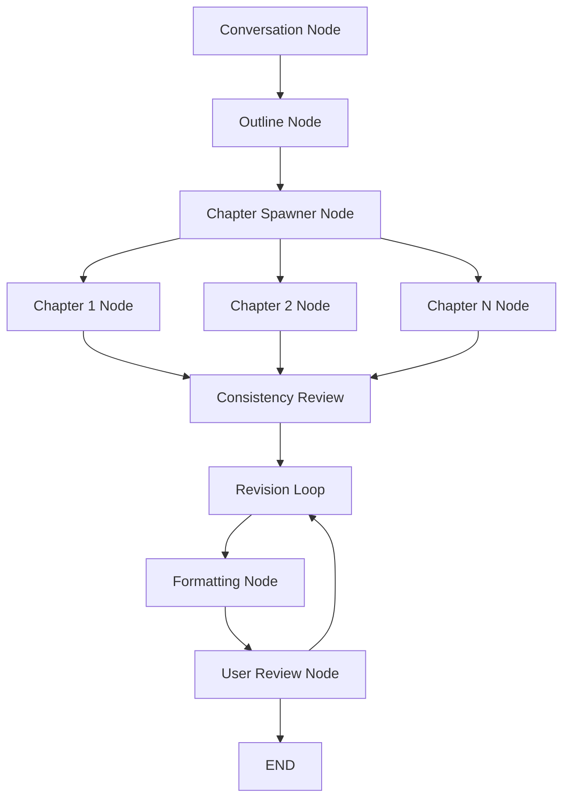

# Book Agent - Architecture Specification

## System Overview

Multi-layer TypeScript application using LangGraph for AI orchestration, Next.js for full-stack framework, and Supabase for data persistence. Designed for scalable, parallel book generation with comprehensive error handling and state management.

## Technology Stack

| Component | Technology | Version | Purpose |
|-----------|------------|---------|---------|
| **Runtime** | Node.js + TypeScript | 18+ / 5.0+ | Type-safe server and client code |
| **Framework** | Next.js | 15+ | Full-stack React application |
| **AI Orchestration** | LangGraph | Latest | Dynamic workflow with parallel execution |
| **LLM Provider** | OpenAI GPT-5 mini | Latest | Text generation with configurable parameters |
| **Database** | Supabase (PostgreSQL) | Latest | Data persistence with real-time features |
| **State Management** | Zustand + React Query | Latest | Client state + server state caching |
| **UI Components** | shadcn/ui + Tailwind CSS | Latest | Component library with utility-first styling |
| **PDF Generation** | React-PDF + DALL-E 3 | Latest | Document generation and cover design |
| **File Processing** | pdf-parse | Latest | PDF text extraction |
| **Web Research** | Firecrawl | Latest | External content research |
| **Testing** | Vitest + Playwright | Latest | Unit, integration, and E2E testing |
| **Deployment** | Vercel | Latest | Serverless hosting with edge functions |

## Architecture Layers

### 1. Presentation Layer (`/app`, `/components`)

**Responsibility**: User interface and interaction management

**Components**:
- **Multi-step Wizard**: Sequential UI for book creation stages
- **Chat Interface**: Embedded conversational AI for requirements gathering
- **Progress Dashboard**: Real-time workflow status and chapter progress
- **PDF Viewer**: In-browser book preview and download

**Key Files**:
- `app/page.tsx` - Main wizard container
- `components/wizard/` - Step-by-step UI components
- `components/chat/` - AI conversation interface
- `components/dashboard/` - Progress monitoring
- `components/pdf/` - Document viewing and download

### 2. Service Layer (`/lib`)

**Responsibility**: Business logic and external service integration

**Core Services**:

#### AI Orchestration (`/lib/agents`)
```typescript
// LangGraph workflow definition
export const bookCreationGraph = new StateGraph({
  nodes: {
    conversation: conversationNode,
    outline: outlineNode,
    chapterSpawner: chapterSpawnerNode,
    consistencyReview: consistencyReviewNode,
    qualityReview: qualityReviewNode,
    formatting: formattingNode,
    userReview: userReviewNode
  },
  edges: {
    conversation: ['outline'],
    outline: ['chapterSpawner'],
    chapterSpawner: ['consistencyReview'], // After all parallel chapters
    consistencyReview: ['qualityReview'],
    qualityReview: ['formatting'],
    formatting: ['userReview'],
    userReview: ['END', 'qualityReview'] // Conditional revision loop
  }
});
```

#### Tool System (`/lib/tools`)
```typescript
// Modular tool definitions for agent use
export const tools = {
  pdfExtractTool: createTool({
    name: 'pdf_extract',
    description: 'Extract text content from uploaded PDF files',
    parameters: { fileBuffer: 'Buffer', options: 'object' }
  }),
  webResearchTool: createTool({
    name: 'web_research',
    description: 'Research topics using Firecrawl web scraping',
    parameters: { query: 'string', maxPages: 'number' }
  }),
  chapterWriteTool: createTool({
    name: 'chapter_write',
    description: 'Generate chapter content with specific parameters',
    parameters: { outline: 'object', style: 'object', wordCount: 'number' }
  }),
  supabaseStateTool: createTool({
    name: 'supabase_state',
    description: 'Persist and retrieve workflow state',
    parameters: { operation: 'string', data: 'object' }
  })
};
```

#### State Management (`/lib/state`)
```typescript
// Zustand stores for application state
export const useBookStore = create<BookState>((set) => ({
  currentStage: 'conversation',
  bookData: null,
  chapterProgress: {},
  updateStage: (stage) => set({ currentStage: stage }),
  updateProgress: (progress) => set({ chapterProgress: progress })
}));

// React Query for server state
export const useWorkflowState = () => {
  return useQuery({
    queryKey: ['workflow', sessionId],
    queryFn: () => fetchWorkflowState(sessionId),
    refetchInterval: 5000 // Real-time updates
  });
};
```

### 3. Data Layer (`/lib/database`)

**Responsibility**: Data persistence and retrieval

#### Database Schema (Supabase)
```sql
-- Core workflow tracking
CREATE TABLE book_sessions (
  id UUID PRIMARY KEY DEFAULT gen_random_uuid(),
  user_id UUID REFERENCES auth.users(id),
  status TEXT NOT NULL CHECK (status IN ('active', 'completed', 'failed')),
  current_stage TEXT NOT NULL,
  requirements JSONB,
  created_at TIMESTAMP DEFAULT NOW(),
  updated_at TIMESTAMP DEFAULT NOW()
);

-- Book content and structure
CREATE TABLE books (
  id UUID PRIMARY KEY DEFAULT gen_random_uuid(),
  session_id UUID REFERENCES book_sessions(id),
  title TEXT,
  author TEXT,
  outline JSONB,
  style_guide JSONB,
  word_count INTEGER,
  pdf_url TEXT,
  created_at TIMESTAMP DEFAULT NOW()
);

-- Individual chapter management
CREATE TABLE chapters (
  id UUID PRIMARY KEY DEFAULT gen_random_uuid(),
  book_id UUID REFERENCES books(id),
  chapter_number INTEGER NOT NULL,
  title TEXT NOT NULL,
  content TEXT,
  word_count INTEGER,
  status TEXT CHECK (status IN ('pending', 'writing', 'completed', 'needs_revision')),
  dependencies INTEGER[],
  created_at TIMESTAMP DEFAULT NOW()
);

-- Workflow state persistence
CREATE TABLE workflow_states (
  id UUID PRIMARY KEY DEFAULT gen_random_uuid(),
  session_id UUID REFERENCES book_sessions(id),
  node_name TEXT NOT NULL,
  state_data JSONB NOT NULL,
  timestamp TIMESTAMP DEFAULT NOW()
);
```

## LangGraph Workflow Design

### Dynamic Parallel Architecture



### Node Implementations

#### 1. Conversation Node
```typescript
async function conversationNode(state: WorkflowState): Promise<WorkflowState> {
  // Extract PDF content if provided
  if (state.pdfFile) {
    const extractedText = await tools.pdfExtractTool.invoke({
      fileBuffer: state.pdfFile,
      options: { preserveLineBreaks: false }
    });
    state.baseContent = extractedText;
  }

  // Guided conversation for requirements
  const requirements = await collectRequirements(state.userPrompt, state.baseContent);

  // Generate style samples
  const styleSamples = await generateStyleSamples(requirements);
  const selectedStyle = await presentStyleChoice(styleSamples);

  return {
    ...state,
    requirements,
    styleGuide: selectedStyle,
    currentStage: 'outline'
  };
}
```

#### 2. Outline Generation Node
```typescript
async function outlineNode(state: WorkflowState): Promise<WorkflowState> {
  const { requirements } = state;

  // Phase 1: Generate title options
  const titleOptions = await generateTitleOptions(requirements);
  const selectedTitle = titleOptions[0]; // For MVP, auto-select first

  // Phase 2: Plan chapter structure
  const chapterStructure = await planChapterStructure(requirements, selectedTitle);

  // Phase 3: Create detailed chapter outlines
  const detailedOutlines = await Promise.all(
    chapterStructure.chapterTitles.map(async (title, index) => {
      return await createChapterOutline({
        chapterNumber: index + 1,
        title,
        wordCount: chapterStructure.wordDistribution[index],
        requirements
      });
    })
  );

  // Phase 4: Validate and finalize outline
  const outline = {
    title: selectedTitle,
    chapters: detailedOutlines,
    totalWordCount: detailedOutlines.reduce((sum, ch) => sum + ch.wordCount, 0),
    estimatedPages: Math.ceil(totalWordCount / 250)
  };

  // Ensure minimum word count with automatic adjustment
  const finalOutline = await validateAndAdjustOutline(outline);

  return {
    ...state,
    outline: finalOutline,
    currentStage: 'chapter_spawning'
  };
}
```

#### 3. Chapter Spawner Node (Dynamic Parallel Creation)
```typescript
async function chapterSpawnerNode(state: WorkflowState): Promise<WorkflowState> {
  const { outline } = state;

  // Create parallel chapter nodes dynamically
  const chapterNodes = outline.chapters.map((chapter, index) => ({
    nodeId: `chapter_${index + 1}`,
    config: {
      chapterNumber: index + 1,
      title: chapter.title,
      outline: chapter.outline,
      wordTarget: chapter.wordCount,
      dependencies: chapter.dependencies || []
    }
  }));

  // Add nodes to graph and execute in parallel
  for (const node of chapterNodes) {
    graph.addNode(node.nodeId, createChapterNode(node.config));
  }

  // Execute all chapter nodes in parallel
  const chapterResults = await Promise.all(
    chapterNodes.map(node =>
      graph.invokeNode(node.nodeId, {
        ...state,
        currentChapter: node.config
      })
    )
  );

  return {
    ...state,
    chapters: chapterResults,
    currentStage: 'consistency_review'
  };
}
```

#### 3. Chapter Node Factory
```typescript
function createChapterNode(config: ChapterConfig) {
  return async (state: WorkflowState): Promise<ChapterResult> => {
    // Research phase
    const researchData = await tools.webResearchTool.invoke({
      query: `${config.title} ${state.requirements.topic}`,
      maxPages: 5
    });

    // Content generation
    const chapterContent = await tools.chapterWriteTool.invoke({
      outline: config.outline,
      style: state.styleGuide,
      wordCount: config.wordTarget,
      baseContent: state.baseContent,
      researchData: researchData,
      dependencies: getDependentChapterContent(config.dependencies, state)
    });

    // Persist chapter
    await tools.supabaseStateTool.invoke({
      operation: 'save_chapter',
      data: {
        chapterNumber: config.chapterNumber,
        content: chapterContent,
        status: 'completed'
      }
    });

    return {
      chapterNumber: config.chapterNumber,
      title: config.title,
      content: chapterContent,
      wordCount: chapterContent.split(' ').length,
      status: 'completed'
    };
  };
}
```

## Error Handling & Resilience

### Retry Strategy
```typescript
export const retryConfig = {
  apiCalls: {
    maxRetries: 3,
    backoffMultiplier: 2,
    initialDelay: 1000,
    maxDelay: 30000
  },
  fileProcessing: {
    maxRetries: 2,
    timeout: 60000
  },
  chapterGeneration: {
    maxRetries: 1, // Expensive operations
    timeout: 300000 // 5 minutes per chapter
  }
};

// Automatic retry wrapper for tools
export function withRetry<T>(
  operation: () => Promise<T>,
  config: RetryConfig
): Promise<T> {
  return retry(operation, {
    retries: config.maxRetries,
    factor: config.backoffMultiplier,
    minTimeout: config.initialDelay,
    maxTimeout: config.maxDelay
  });
}
```

### State Persistence Strategy
```typescript
// Checkpoint system for workflow recovery
export async function saveCheckpoint(sessionId: string, state: WorkflowState) {
  await supabase
    .from('workflow_states')
    .upsert({
      session_id: sessionId,
      node_name: state.currentStage,
      state_data: state,
      timestamp: new Date().toISOString()
    });
}

// Recovery from last successful checkpoint
export async function recoverWorkflow(sessionId: string): Promise<WorkflowState> {
  const { data } = await supabase
    .from('workflow_states')
    .select('*')
    .eq('session_id', sessionId)
    .order('timestamp', { ascending: false })
    .limit(1);

  return data?.[0]?.state_data || getInitialState();
}
```

## Performance Optimization

### Parallel Processing
- **Chapter Generation**: N chapters execute simultaneously
- **Research Operations**: Concurrent web scraping for multiple topics
- **PDF Processing**: Asynchronous file handling with worker threads

### Caching Strategy
```typescript
// React Query configuration for server state
export const queryClient = new QueryClient({
  defaultOptions: {
    queries: {
      staleTime: 5 * 60 * 1000, // 5 minutes
      cacheTime: 30 * 60 * 1000, // 30 minutes
      refetchOnWindowFocus: false
    }
  }
});

// Supabase real-time subscriptions for live updates
export function useChapterProgress(sessionId: string) {
  return useSubscription(
    supabase
      .channel('chapter_progress')
      .on('postgres_changes', {
        event: 'UPDATE',
        schema: 'public',
        table: 'chapters',
        filter: `book_id=eq.${sessionId}`
      }, (payload) => {
        queryClient.invalidateQueries(['chapters', sessionId]);
      })
  );
}
```

## Security Considerations

### File Upload Security
```typescript
// PDF validation and sanitization
export async function validatePDF(file: File): Promise<boolean> {
  // File type validation
  if (!file.type.includes('pdf')) {
    throw new Error('Invalid file type');
  }

  // Size validation (50MB limit)
  if (file.size > 50 * 1024 * 1024) {
    throw new Error('File size exceeds limit');
  }

  // Basic malware scanning
  const buffer = await file.arrayBuffer();
  return await scanForMalware(buffer);
}
```

### API Key Management
```typescript
// Environment variable validation
const requiredEnvVars = [
  'OPENAI_API_KEY',
  'SUPABASE_URL',
  'SUPABASE_ANON_KEY',
  'FIRECRAWL_API_KEY'
];

export function validateEnvironment() {
  for (const envVar of requiredEnvVars) {
    if (!process.env[envVar]) {
      throw new Error(`Missing required environment variable: ${envVar}`);
    }
  }
}
```

## Deployment Architecture

### Vercel Configuration
```typescript
// vercel.json
{
  "functions": {
    "app/api/workflow/route.ts": {
      "maxDuration": 300 // 5 minutes for long-running operations
    }
  },
  "env": {
    "OPENAI_API_KEY": "@openai-api-key",
    "SUPABASE_URL": "@supabase-url",
    "SUPABASE_ANON_KEY": "@supabase-anon-key"
  }
}
```

### Edge Function Optimization
```typescript
// Optimize for serverless execution
export const runtime = 'nodejs';
export const maxDuration = 300;

// Connection pooling for database
const supabaseClient = createClient(
  process.env.SUPABASE_URL,
  process.env.SUPABASE_ANON_KEY,
  {
    db: {
      schema: 'public',
    },
    auth: {
      persistSession: false
    }
  }
);
```

## Testing Strategy

### Test Coverage Requirements
- **Unit Tests**: 90% coverage for utility functions and tools
- **Integration Tests**: All LangGraph node interactions
- **E2E Tests**: Complete book generation workflow
- **Contract Tests**: OpenAI and Supabase API integrations

### Test Structure
```typescript
// Tool testing
describe('pdfExtractTool', () => {
  it('extracts text from valid PDF', async () => {
    const mockPDF = await loadFixture('sample.pdf');
    const result = await tools.pdfExtractTool.invoke({
      fileBuffer: mockPDF,
      options: {}
    });
    expect(result).toContain('expected text content');
  });
});

// Workflow testing
describe('Book Creation Workflow', () => {
  it('completes full workflow with minimal input', async () => {
    const result = await runWorkflow({
      userPrompt: 'artificial intelligence guide',
      requirements: mockRequirements
    });
    expect(result.status).toBe('completed');
    expect(result.book.wordCount).toBeGreaterThan(30000);
  });
});
```

## Monitoring & Observability

### Performance Metrics System (`/lib/monitoring/metrics.ts`)
```typescript
// Comprehensive metrics collection with Prometheus compatibility
export const applicationMetrics = {
  // Workflow performance
  workflowDuration: metricsRegistry.createHistogram('workflow_duration_seconds'),
  chapterGenerationTime: metricsRegistry.createHistogram('chapter_generation_seconds'),

  // Error tracking
  workflowErrors: metricsRegistry.createCounter('workflow_errors_total'),
  toolErrors: metricsRegistry.createCounter('tool_errors_total'),

  // Resource monitoring
  activeWorkflows: metricsRegistry.createGauge('active_workflows_count'),
  databaseConnections: metricsRegistry.createGauge('database_connections_count'),

  // Tool performance
  toolExecutionTime: metricsRegistry.createHistogram('tool_execution_seconds'),
  apiRequests: metricsRegistry.createCounter('api_requests_total')
};

// Automatic timing with decorators
@timed(applicationMetrics.chapterGenerationTime)
async function generateChapter(config: ChapterConfig): Promise<ChapterResult> {
  // Method automatically timed
}

// Prometheus export for external monitoring
const prometheusMetrics = metricsRegistry.exportPrometheusFormat();
```

### Analytics & Event Tracking (`/lib/monitoring/analytics.ts`)
```typescript
// Structured event tracking with context enrichment
export async function trackEvent(eventType: string, context: Record<string, unknown>) {
  const event: AnalyticsEvent = {
    eventType,
    timestamp: new Date().toISOString(),
    sessionId: getCurrentSessionId(),
    userId: getCurrentUserId(),
    context: {
      ...context,
      userAgent: getBrowserInfo(),
      environment: process.env.NODE_ENV
    }
  };

  await processEvent(event);
}

// User journey tracking
export async function trackUserJourney(step: string, context: Record<string, unknown>) {
  await trackEvent('user_journey', { step, ...context });
}

// Error tracking with full context
export async function trackError(error: Error, context: Record<string, unknown>) {
  await trackEvent('error_occurred', {
    errorType: error.constructor.name,
    errorMessage: error.message,
    stack: error.stack,
    ...context
  });
}

// Usage tracking
export function trackWorkflowEvent(event: string, metadata: object) {
  analytics.track(event, {
    timestamp: Date.now(),
    sessionId: metadata.sessionId,
    stage: metadata.stage,
    ...metadata
  });
}
```